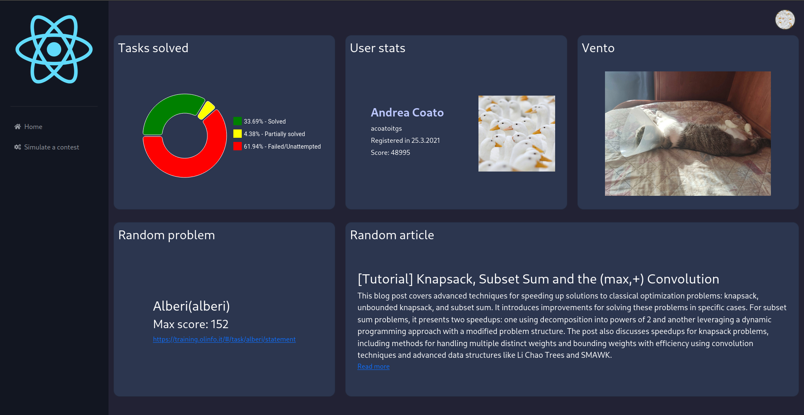

# TODO / FIXES:
 - [ ] If the user creates a token manually, the app acts like the user exists, making requests and processing garbage data.
 - [ ] The current react code is pretty trash, it could be optimized for faster loading.
 - [ ] The backend currently queries the entire database whilst not necessary.
 - [ ] A universal startup script is needed, which accounts for different OS and distros.
 - [ ] If pip is externally managed the setup script won't work.
 - [ ] Before attempting to install stuff, the setup script should check if the required packages exist.
 - [ ] Fix graphics of logout page.
 - [ ] Add images/decoration on the right side of the login page.
 